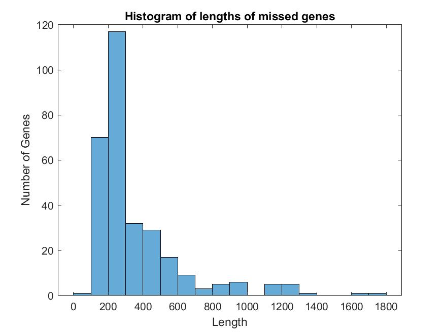
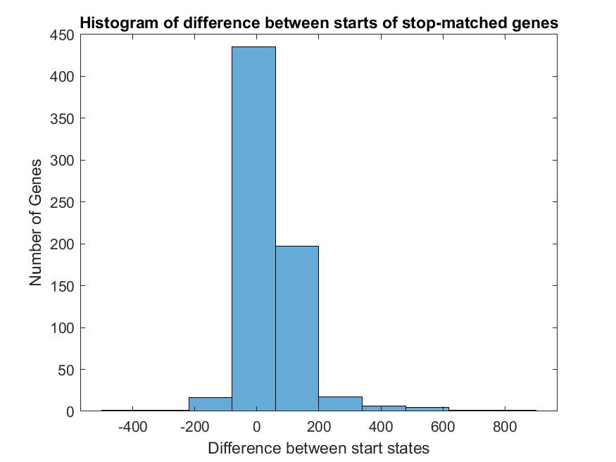

# Comp 561 Computational Biology Methods and Research - Homework #3

grade = 100%

## Question 1

### a) 

i) Average Length of Intergenic Regions: 1164.4bp

ii) Average Length of Genic Regions: 991.4515bp

iii) Nucleotide Frequency Table 

|       | Frequency |
| :---: | :-------: |
|   A   |  0.2651   |
|   C   |  0.2441   |
|   G   |  0.2262   |
|   T   |  0.2646   |

iv) see [configurations.xlsx](configurations.xlsx) for the codon frequency table (emission table)

Code for this section: [q1_a.mlx](q1_a.mlx)

### b)

The code for the Viterbi algorithm is found in [Viterbi.m](Viterbi.m) and it uses the matlab function [findGenes.m](findGenes.m)

To run it, just call the Viterbi function in matlab with the names of the three files as the arguments. 

```matlab
Viterbi(fastaFilename, configFilename, outputFile)
```

This will automatically save the output in gff3 format.

### c) 

The gene predictions are found in [vulnificusOutput.gff3](vulnificusOutput.gff3) 

### d) 

Code for this section and the next is found in [q1_d.mlx](q1_d.mlx)

The fraction of annotated genes that:
* Perfectly match a guessed gene: 59.8%
* Match stop but not start: 27.8%
* Match start but not stop: 0
* Do not match at all: 12.4 %

The fraction of guessed genes that:
* Perfectly match an annotated gene: 54.3%
* Match stop but not start: 25.3%
* Match start but not stop: 0
* Do not match at all: 20.4 %

### e) 

There are two properties that cause genes to be missed. 

1. The genes that were completely missed tended to be small in length (100-500bp). This is shown in the histogram below:

    
    
2. The genes that were matched for their stop but not their start always had a starting point that was close to the real one. Usually less than 100 basepairs away, and almost always less than 200 basepairs away, as seen in this histogram:

    

    Another thing to notice is that the real starting point was usually upstream from the predicted point.
    
    
## Question 2

Basically this would be the same thing as the algorithm for question 1, 
there would be a intergenic state, start and stop state, and 999 middle states.

The probability of transition
* From start to middle1 is P(L > 1)
* From start to stop is P(L=1)
* From middle1 to middle2 is P(L > 3).
* From middle2 to stop is P(L=3). 

etc.
